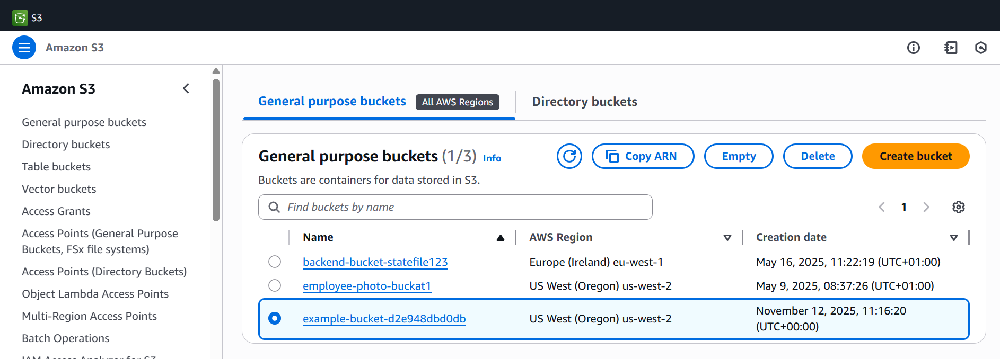

# AWS S3 Object Storage Project

This project demonstrates how to **create, configure, and interact with an Amazon S3 bucket** using two approaches:
1. **Infrastructure as Code (IaC)** via Terraform.
2. **Programmatic interaction** using Python (`boto3`) inside a Jupyter Notebook.

The workflow includes:
- Creating an S3 bucket and IAM role with Terraform. However, We also can create the bucket using boto3 
- Uploading structured (CSV), semi-structured (JSON), and unstructured (image) data to S3.
- Querying, downloading, and managing files via Python SDK.
- Configuring bucket access, public policies, and object versioning.


## 🗂️ Project Overview

This project is split into two main components:


**Terraform Setup** :Provisions the S3 bucket, IAM role, and policies for access. 

**Python Notebook** : Uploads, downloads, and queries data in the S3 bucket programmatically (you can find the explaination of this section in `s3_interaction.ipynb` notebook file)


## Requirements

### 1. Software
- **Python 3.9+**
- **Terraform 1.5+**
- **AWS CLI v2**
- **Jupyter Notebook** (or VS Code with Jupyter extension)


## AWS Credentials
Before start creating the bucket or interacting with it, You must configure your AWS credentials( you create the access keys from your AWS account)  in a .env file at the project root:
```bash
AWS_ACCESS_KEY_ID=your-access-key-id
AWS_SECRET_ACCESS_KEY=your-secret-access-key
AWS_DEFAULT_REGION=us-west-2
```

## Create AWS Infrastructure using Terraform
Terraform handles the provisioning of your S3 bucket, IAM Role, and Policy automatically.
### 1. activate .env file 
```bash
source .env
```
### 2. Initialize Terraform
```bash
terraform init
```
### 3. Format your codes
```bash
terraform fmt
```
### 4. Preview Changes
```bash
terraform plan
```
### 5. Apply Configuration
```bash
terraform apply
```
#### This will create:

-An S3 bucket (name will include a random suffix).

-An IAM Role with AssumeRole permissions.

-A Policy granting GetObject, PutObject, and DeleteObject on the bucket.

-A Role-Policy attachment linking both.

Learn more: [Terraform AWS S3 Documentation](https://registry.terraform.io/providers/hashicorp/aws/latest/docs/resources/s3_bucket)

Afterward, you should be able to see the bucket in AWS consol


### 6. Cleanup
To safely delete all resources created by Terraform
```bash
terraform destroy
```

#### This will:

-Remove all S3 objects and versions.

-Delete IAM roles and policies.

-Destroy the S3 bucket itself.

⚠️ Ensure you download or back up any required data before destroying resources.

## References

[AWS S3 Documentation](https://registry.terraform.io/providers/hashicorp/aws/latest/docs/resources/s3_bucket)

[Boto3 S3 Client API](https://boto3.amazonaws.com/v1/documentation/api/latest/reference/services/s3.html)

[Terraform AWS Provider](https://registry.terraform.io/providers/hashicorp/aws/latest/docs)

[AWS IAM Best Practices](https://docs.aws.amazon.com/IAM/latest/UserGuide/best-practices.html)


